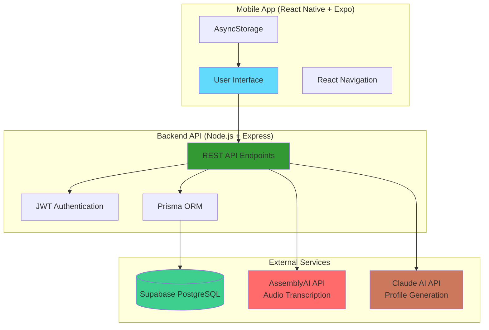
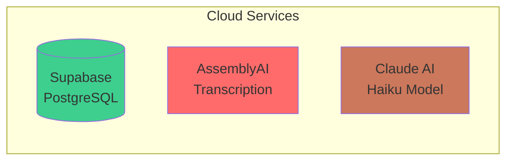
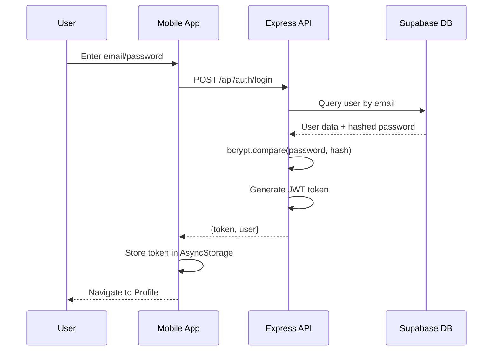
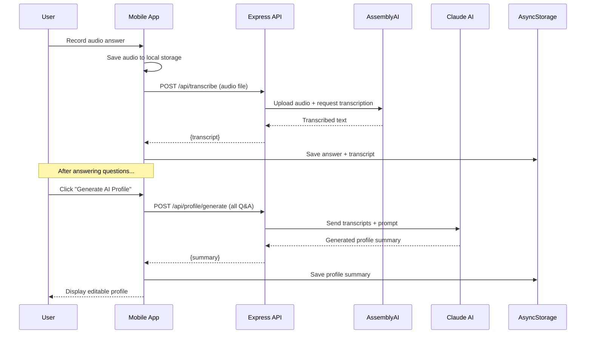
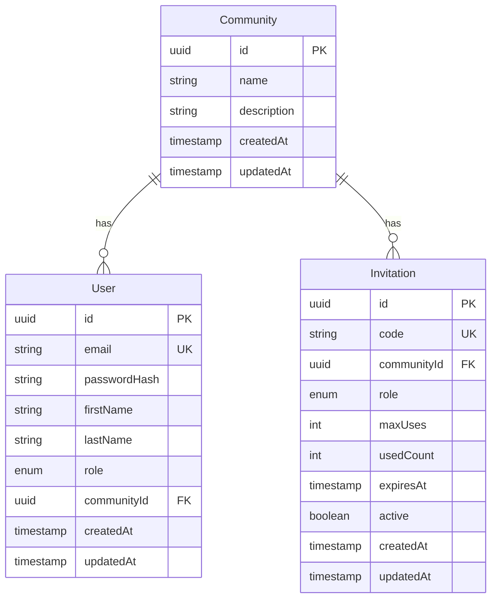
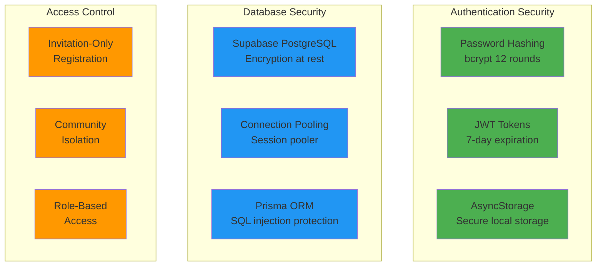
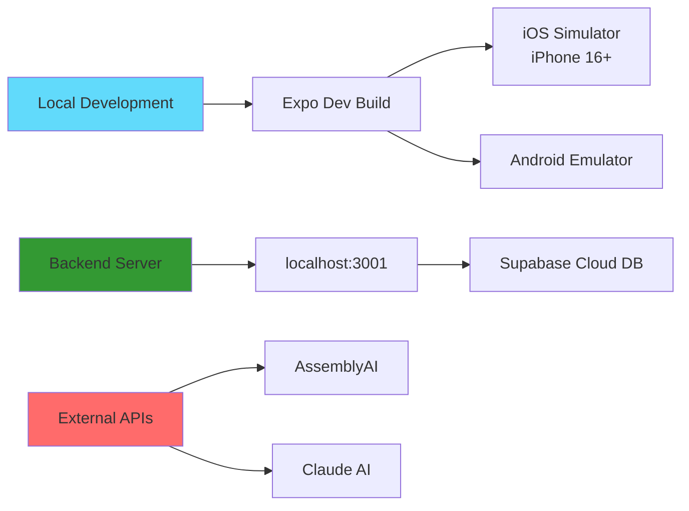

# Cozy - Architecture & Tech Stack

## System Overview



## Technology Stack

### Frontend (Mobile App)

```mermaid
graph LR
    subgraph "React Native Ecosystem"
        RN[React Native 0.81.4]
        Expo[Expo SDK 54.0.10]
        TS[TypeScript]
        Nav[React Navigation]
        AS[AsyncStorage]
    end

    RN --> Expo
    TS --> RN
    Nav --> RN
    AS --> RN

    style RN fill:#61dafb
    style Expo fill:#000020
    style TS fill:#3178c6
```


### Backend (API Server)

```mermaid
graph LR
    subgraph "Node.js Backend"
        Node[Node.js]
        Express[Express 5.1]
        PrismaORM[Prisma ORM]
        JWT[JWT Tokens]
        Bcrypt[bcrypt]
    end

    Node --> Express
    Express --> PrismaORM
    Express --> JWT
    Express --> Bcrypt

    style Node fill:#339933
    style Express fill:#000000
    style PrismaORM fill:#2d3748
```


### External Services


## Authentication Flow



## Profile Generation Flow



## Data Architecture

```mermaid
graph TB
    subgraph "Mobile Local Storage"
        AS1[JWT Token]
        AS2[Audio Recordings]
        AS3[Transcripts]
        AS4[Profile Summary]
        AS5[Section Progress]
    end

    subgraph "Backend API Layer"
        Route1[/api/auth/*]
        Route2[/api/transcribe]
        Route3[/api/profile/generate]
    end

    subgraph "Database (Supabase)"
        User[(Users)]
        Community[(Communities)]
        Invitation[(Invitations)]
    end

    AS1 --> Route1
    AS2 --> Route2
    AS3 --> Route3
    AS4 --> Route3

    Route1 --> User
    Route1 --> Community
    Route1 --> Invitation

    style AS1 fill:#ffd700
    style AS2 fill:#ffd700
    style AS3 fill:#ffd700
    style AS4 fill:#ffd700
    style AS5 fill:#ffd700
```

## Key Components

### Mobile App Structure
```
src/
├── screens/          # UI Screens
│   ├── ProfileScreen.tsx        (AI summary + progress)
│   ├── QuestionFlowScreen.tsx   (Section selection)
│   ├── AnswerQuestionScreen.tsx (Audio recording)
│   └── CommunityScreen.tsx      (Community view)
├── navigation/       # React Navigation setup
├── contexts/         # Auth context
├── services/         # API calls
│   └── api.ts        (transcribe, generateProfile)
└── components/       # Reusable UI components
```

### Backend API Structure
```
backend/src/
├── routes/
│   ├── auth.ts          (Login, Register)
│   ├── transcribe.ts    (AssemblyAI integration)
│   ├── profile.ts       (Claude AI integration)
│   └── invitations.ts   (Invitation codes)
├── services/
│   ├── transcription.ts (AssemblyAI client)
│   └── claude.ts        (Claude AI client)
└── prisma/
    └── schema.prisma    (Database schema)
```

## Database Schema



## API Endpoints

### Authentication
- `POST /api/auth/login` - User login
- `POST /api/auth/register` - User registration (requires invitation code)

### Audio & Transcription
- `POST /api/transcribe` - Upload audio, get transcript via AssemblyAI

### Profile Generation
- `POST /api/profile/generate` - Generate AI profile summary via Claude

### Invitations
- `POST /api/invitations/validate` - Check if invitation code is valid

## Environment Variables

### Backend (.env)
```bash
# Database
DATABASE_URL=postgresql://...              # Supabase session pooler
DIRECT_URL=postgresql://...                # Supabase direct connection

# Authentication
JWT_SECRET=your-secret-key                 # JWT signing key

# External APIs
ASSEMBLYAI_API_KEY=your-key               # Audio transcription
ANTHROPIC_API_KEY=your-key                # Claude AI (Haiku model)

# Server
PORT=3001
NODE_ENV=development
```

## Security Features



## Development Workflow



---

**Last Updated:** January 2025
**Framework Versions:** React Native 0.81.4, Expo SDK 54, Node.js 18+
