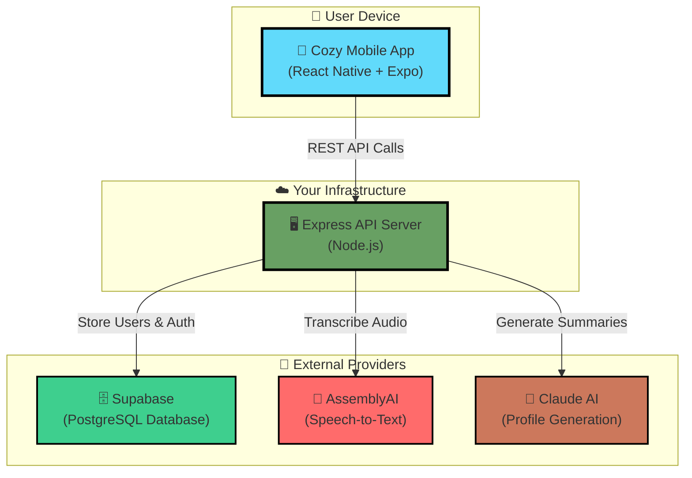
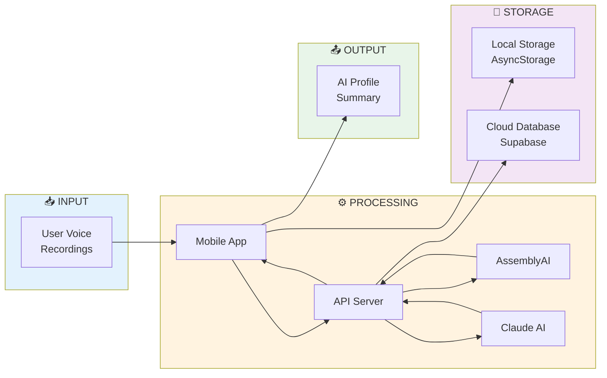
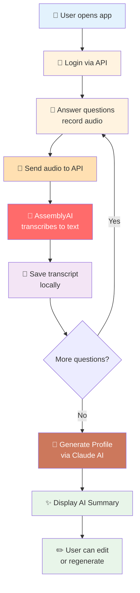
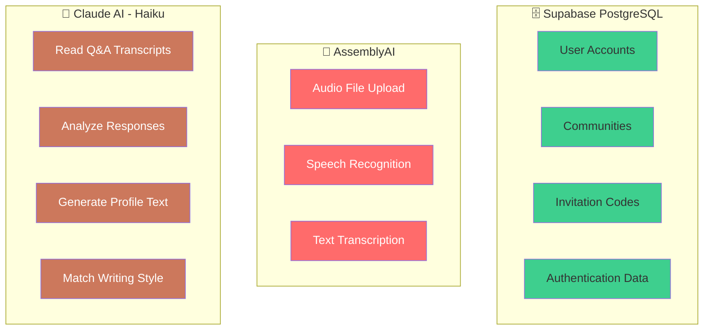
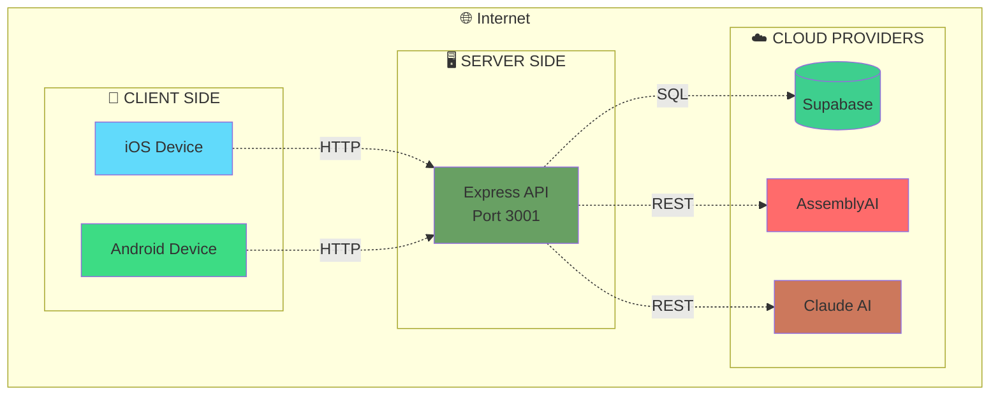
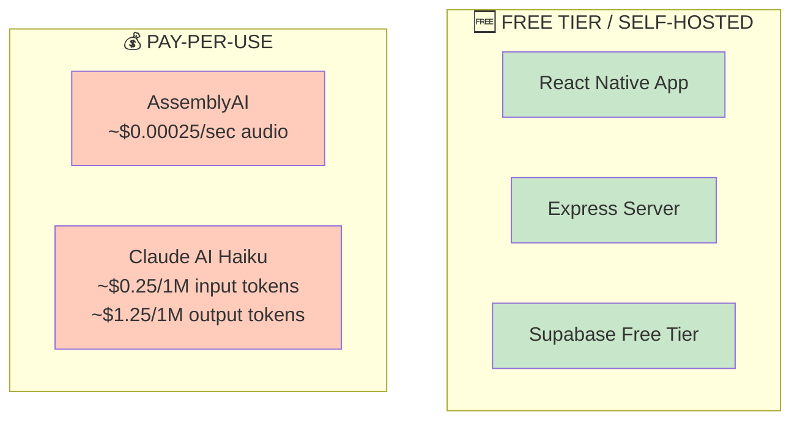

# Cozy - Simple System Schematic

## High-Level Architecture



## System Components



## Data Flow (Simplified)



## Provider Responsibilities



## Network Diagram



## Cost Structure



## 3-Tier Architecture

```
┌─────────────────────────────────────────┐
│         PRESENTATION TIER               │
│                                         │
│   📱 React Native Mobile App            │
│   • User Interface                      │
│   • Local Storage (AsyncStorage)        │
│   • Audio Recording                     │
└─────────────────────────────────────────┘
                    ↕ HTTP/REST
┌─────────────────────────────────────────┐
│         APPLICATION TIER                │
│                                         │
│   🖥️ Express API Server (Node.js)      │
│   • Business Logic                      │
│   • Authentication (JWT)                │
│   • API Endpoints                       │
│   • Integration Layer                   │
└─────────────────────────────────────────┘
                    ↕
        ┌───────────┼───────────┐
        ↓           ↓           ↓
┌──────────┐  ┌──────────┐  ┌──────────┐
│   DATA   │  │   AI     │  │   AI     │
│   TIER   │  │  SPEECH  │  │   TEXT   │
│          │  │          │  │          │
│ 🗄️ Supa  │  │ 🎤 Asm   │  │ 🤖 Claude│
│   base   │  │   blyAI  │  │   AI     │
└──────────┘  └──────────┘  └──────────┘
```

## Request Flow Example

**User records answer to "What do you do for fun?"**

```
1. 📱 App → Records audio → Saves locally
                ↓
2. 📱 App → POST /api/transcribe → 🖥️ API
                ↓
3. 🖥️ API → Upload audio → 🎤 AssemblyAI
                ↓
4. 🎤 AssemblyAI → Transcribes → "I love hiking and playing guitar"
                ↓
5. 🖥️ API → Returns transcript → 📱 App
                ↓
6. 📱 App → Saves transcript locally
                ↓
           [User answers more questions]
                ↓
7. 📱 App → POST /api/profile/generate → 🖥️ API
                ↓
8. 🖥️ API → Sends all Q&A → 🤖 Claude AI
                ↓
9. 🤖 Claude → Generates profile → "John is an outdoorsy music lover..."
                ↓
10. 🖥️ API → Returns summary → 📱 App
                ↓
11. 📱 App → Displays editable profile ✨
```

---

**🔑 Key Takeaway:** Simple 3-component system
1. **Mobile App** (user interface)
2. **Your API Server** (orchestrator)
3. **3 Cloud Providers** (Supabase, AssemblyAI, Claude)
